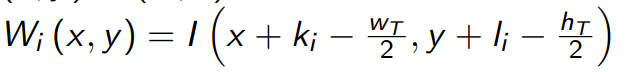
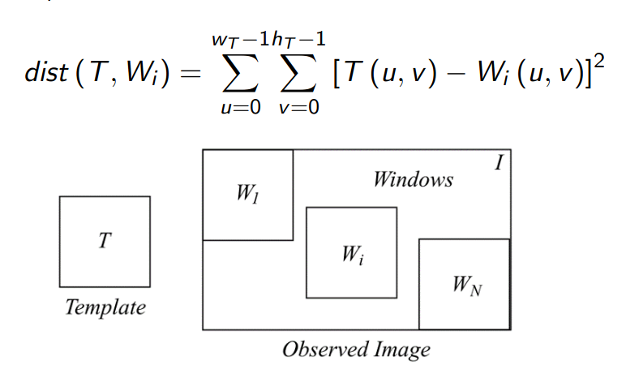
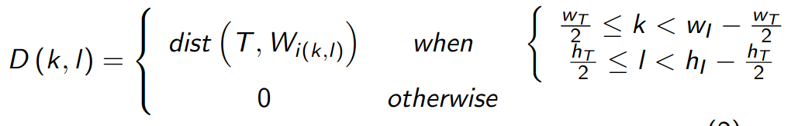
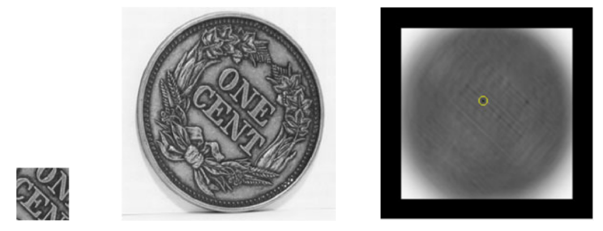
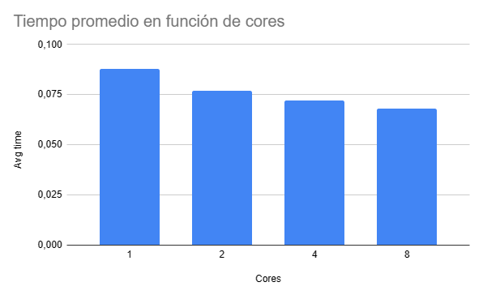

Laboratorio IV Sistemas Operativos 2 
### Ingeniería en Computación - FCEFyN - UNC
# Memoria compartida

## Introducción
Los niveles de integración electrónica han permitido la generación de procesadores de arquitecturas multiprocesos, multicore, híbridos y ahora many integrated core (MIC). Este avance hace necesario que los programadores cuenten con un profundo conocimiento del hardware sobre el que se ejecutan sus programas, y que dichos programas ya no pueden ser monoproceso.

Entre las técnicas y estándares más utilizados para sistemas de memoria compartida y memoria distribuida, se encuentra OpenMP y MPI respectivamente.

## Objetivo
El objetivo del presente trabajo práctico es que el estudiante sea capaz diseñar una solución que utilice el paradigma de memoria distribuida, utilizando OpenMP, en lenguaje C.

## Desarrollo
### Problema a desarrollar
Se pide que se diseñe, valide e implemente un programa que realice un algoritmo de [reconocimiento de patrones](https://en.wikipedia.org/wiki/Pattern_recognition) en imágenes, utilizando el lenguaje C y la librería OpenMP.

Dentro de la carpeta img, se encuentrean dos archivos de imágenes, que llamaremos _I_ a la imagen principal y _T_ al patrón que debemos encontrar. 

Se debe implem entar un algoritmo simple que consite en definir una ventana (_window_) de iguales dimensiones que _T_ (w<sub>T</sub> x h<sub>T</sub>), que se desplaza por toda la imagen.

Si el centro de la ventana  W<sub>i</sub> es el par (K<sub>i</sub>, I<sub>i</sub>), entonces podemos definir:




Para cada ventana W<sub>i</sub> se computa la distancia euclideana entre T y W<sub>i</sub> utilizando:



Luego, se debe crear un mapa de distancias, donde cada punto es la distancia entre  W<sub>i</sub> y T.



Por último, se debe seleccionar la posición del mínimo en ese mapa y reportar las coordenadas donde se encuentra.




### Restricciones
Las imágenes deben tratarse cono matrices em R<sub>2</sub> monocromática y es opcional de ustedes convertirlas en un formato amigable para la tarea.
El diseño debe contemplar toda situación no descripta en el presente documento y se debe hacer un correcto manejo de errores.
El diseño debe ser dinámico, y debe adaptarse a distintas imagenes de distintos tamañaos.

### Ejecución del programa
Para ejecutar el programa debemos correr **make** y luego el binario con el siguiente formato:

```shell
./bin/main.out [Number of cores]
```

Si corremos el binario con el número 1 como argumento este correra de forma similar a una ejecución serial.

### Performance
Probando con diferentes armgumentos para la cantidad de hilos se obtuvo el siguiente gráfico:



Se puede ver como el tiempo de ejecución se va reduciendo gradualmente en función de la catidad de hilos que se eligen para correr.
Tiempos promedio corriendo 10 veces con cada configuración:

| 1 hilo | 2 hilos | 4 hilos | 8 hilos |
|--------|---------|---------|---------|
| 0.088  | 0.077   | 0.072   | 0.068   |


Análisis la reducción del tiempo de ejecución:
- 1 hilo  -> 2 hilos: 12.5%
- 2 hilos -> 4 hilos: 6.5%
- 4 hilos -> 8 hilos: 5.5%

## Dependencias
Las dependencias necesarias son:
- make
- binutils
- build-essential

## Links
- [Introduction to parallel programming](https://hpc.llnl.gov/documentation/tutorials/introduction-parallel-computing-tutorial)
- [OpenMP Tutorial](https://hpc-tutorials.llnl.gov/openmp/)
